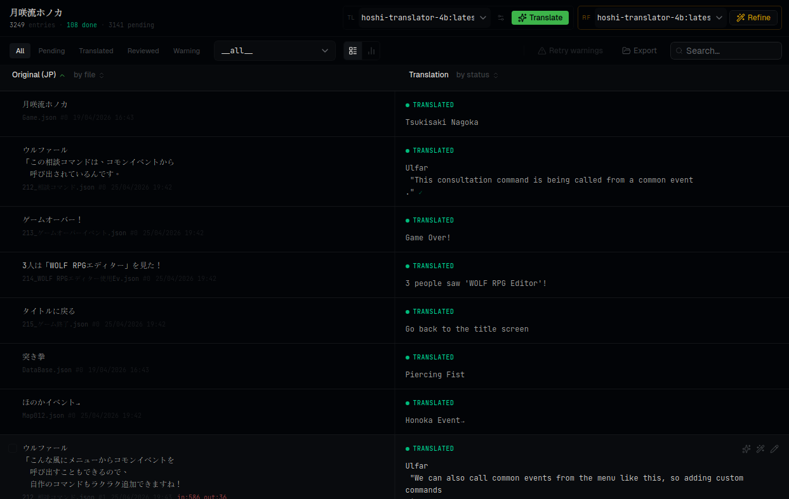
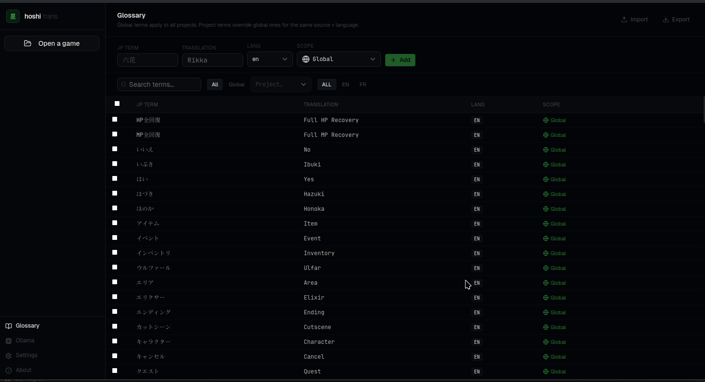

<div align="center">
  <h1>星 hoshi-trans</h1>
  <p><strong>Free, offline Japanese RPG game translator — powered by local AI via Ollama</strong></p>

  <p>
    <a href="https://github.com/KATBlackCoder/hoshi-trans/releases/latest">
      
    </a>
    <a href="https://github.com/KATBlackCoder/hoshi-trans/releases/latest">
      
    </a>
    
  </p>

  <p>
    <a href="https://github.com/KATBlackCoder/hoshi-trans/releases/latest/download/hoshitrans_0.1.0_amd64.AppImage">⬇ Download for Linux</a>
    ·
    <a href="https://github.com/KATBlackCoder/hoshi-trans/releases/latest/download/hoshitrans_0.1.0_x64-setup.exe">⬇ Download for Windows</a>
    ·
    <a href="#setup">Setup guide</a>
  </p>
</div>

---

<!-- Add demo.gif here once recorded:

-->



## What is hoshi-trans?

hoshi-trans is a **free desktop app** that translates Japanese RPG games using AI running entirely on your own machine. No subscription, no cloud, no data leaving your computer.

You point it at a game folder, it extracts all translatable text, runs it through an Ollama model in batches, then injects the translations back — ready to play in English or French.

## Supported game engines

| Engine | Status | Notes |
|--------|--------|-------|
| **RPG Maker MV / MZ** | ✅ Full | Game must be **decrypted** first — use [RPG Maker Decrypter](https://github.com/Petschko/RPG-Maker-MV-Decrypter) if needed |
| **Wolf RPG Editor** | ✅ Full | Requires [WolfTL](https://github.com/Sinflower/WolfTL) dump folder — decrypt first with [UberWolf](https://github.com/Sinflower/UberWolf) if the game is encrypted |
| **Other engines** | 🚫 Not yet | Coming in future releases |

## Features

- **Batch translation** — translates hundreds of lines in parallel, with cancel support
- **Refine pass** — second-pass quality review using a thinking model
- **Glossary** — project + global term lists auto-populated during translation, keep names consistent
- **Placeholder-safe** — game engine codes (`\N[1]`, `\f[20]`, etc.) are encoded before sending to the model and decoded after, never lost or corrupted
- **Click-to-edit** — fix any translation directly in the table, manual edits feed back into the glossary
- **Inconsistency detection** — flags source texts with multiple different translations
- **Dark/light theme** + accent color

## Screenshots

| Translation view | Glossary |
|---|---|
|  |  |

## Setup

### Requirements

- [Ollama](https://ollama.com) installed and running
- A hoshi-translator model installed (see below)
- **RPG Maker MV/MZ:** decrypted game files — use [RPG Maker Decrypter](https://github.com/Petschko/RPG-Maker-MV-Decrypter) if encrypted
- **Wolf RPG:** a `dump/` folder from [WolfTL](https://github.com/Sinflower/WolfTL) — decrypt first with [UberWolf](https://github.com/Sinflower/UberWolf) if encrypted

### Install hoshi-trans

| Platform | Download |
|----------|----------|
| Linux (AppImage) | [hoshitrans_0.1.0_amd64.AppImage](https://github.com/KATBlackCoder/hoshi-trans/releases/latest/download/hoshitrans_0.1.0_amd64.AppImage) |
| Windows (installer) | [hoshitrans_0.1.0_x64-setup.exe](https://github.com/KATBlackCoder/hoshi-trans/releases/latest/download/hoshitrans_0.1.0_x64-setup.exe) |

### Install the translation model

The easiest way is the **Install Models** button in the Ollama page — it runs `ollama create` for you and pulls the base model automatically.

Or manually (no app required):

```bash
curl -fL -o /tmp/hoshi-4b.Modelfile \
  https://raw.githubusercontent.com/KATBlackCoder/hoshi-trans/main/src-tauri/modelfiles/hoshi-translator-4b.Modelfile
ollama create hoshi-translator-4b -f /tmp/hoshi-4b.Modelfile
```

| Model | Base | VRAM |
|---|---|---|
| `hoshi-translator-4b` | `huihui_ai/qwen3-abliterated:4b-instruct-2507-q8_0` | ~4 GB |
| `hoshi-translator-abliterated-4b` | `huihui_ai/qwen3-abliterated:4b-instruct-2507-fp16` | ~8 GB |
| `hoshi-translator-30b` | `huihui_ai/qwen3-abliterated:30b-a3b-instruct-2507-q4_K_M` | min 24 GB |

### Translate a game

1. Open hoshi-trans → Library → **Open a game**
2. Select the game folder (or `dump/` folder for Wolf RPG)
3. Click **Extract** — all translatable strings are pulled into a table
4. Click **Translate** — batch runs in the background, progress shown live
5. When done, click **Export** — translated files written to `output/` (originals untouched)

## Why local AI?

- **Privacy** — your game files stay on your machine
- **Cost** — free after the one-time model download
- **Speed** — 4B model translates ~50 lines/min on a mid-range GPU
- **Quality** — purpose-built `hoshi-translator` modelfile tuned for RPG dialogue, honorifics, and game engine codes

## Support the project

hoshi-trans is free and open source. If it saved you hours on a translation project, consider a crypto donation:

| Coin | Address |
|------|---------|
| BTC | `bc1qmr578evx5fzwyr754a00j9hkekd2gzpvs8zxzz` |
| ETH | `0x29652Fd86095913d472fF08BFEE5a15c5E7C9D51` |

## Contributing

Bug reports and pull requests welcome. See [CONTEXT.md](docs/CONTEXT.md) for architecture notes.

## License

MIT
